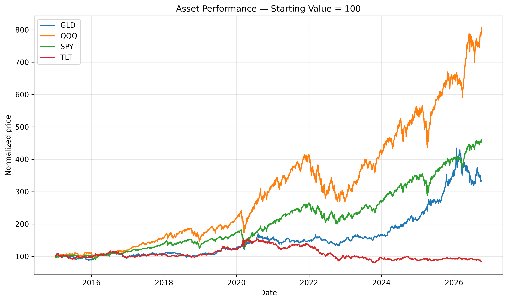
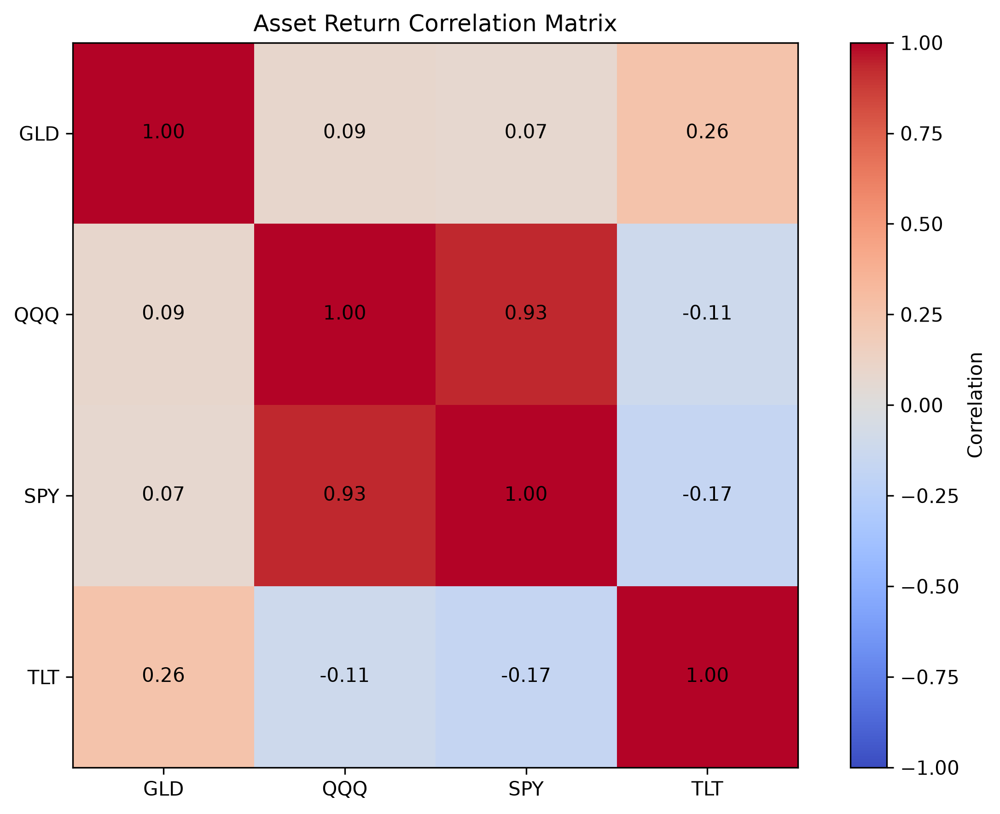

# Project 1 — Markowitz Portfolio Optimization with Python

This project explores portfolio risk, diversification, and mean-variance optimization using historical market data.

The analysis uses four ETFs:

- SPY — S&P 500
- QQQ — Nasdaq-100
- TLT — Long-term U.S. Treasury bond ETF
- GLD — Gold ETF

## Features

- Historical price download using `yfinance`
- Daily logarithmic return calculation
- Covariance and correlation analysis
- Normalized asset performance comparison
- Correlation matrix visualization
- Equal-weight portfolio analysis
- Portfolio expected return and volatility
- Diversification analysis
- Monte Carlo generation of random portfolios
- Monte Carlo minimum-volatility portfolio search
- Exact minimum-variance optimization using SLSQP
- Markowitz minimum-variance frontier
- Monte Carlo maximum-Sharpe portfolio search
- Exact maximum-Sharpe optimization using SLSQP
- Tangency portfolio identification
- Capital Allocation Line visualization

## Methodology

### Portfolio Expected Return

The expected return of a portfolio is

$$
\mu_p = w^T \mu
$$

where:

- $w$ is the vector of portfolio weights
- $\mu$ is the vector of expected asset returns

### Portfolio Variance

Portfolio variance is

$$
\sigma_p^2 = w^T \Sigma w
$$

where:

- $\Sigma$ is the covariance matrix of asset returns

Portfolio volatility is therefore

$$
\sigma_p = \sqrt{w^T \Sigma w}
$$

The covariance terms allow diversification benefits to be captured explicitly.

## Constraints

All numerical optimizations are performed under the constraints

$$
\sum_i w_i = 1
$$

and

$$
0 \leq w_i \leq 1
$$

which correspond to a fully invested portfolio with no short selling.

## Monte Carlo Portfolio Simulation

Random portfolio weights are generated and normalized so that

$$
\sum_i w_i = 1
$$

For each portfolio, annualized expected return and volatility are calculated.

The Monte Carlo simulation provides a visual representation of the feasible risk-return region and an approximate estimate of the minimum-volatility and maximum-Sharpe portfolios.

## Minimum-Variance Optimization

The exact minimum-volatility portfolio is obtained by solving

$$
\min_w \quad w^T \Sigma w
$$

subject to the portfolio constraints.

The optimization is performed using Sequential Least Squares Programming (`SLSQP`) from SciPy.

## Markowitz Frontier

For a sequence of target returns, the optimization solves

$$
\min_w \quad w^T \Sigma w
$$

subject to

$$
w^T \mu = \mu_{\text{target}}
$$

and

$$
\sum_i w_i = 1
$$

This produces the minimum-variance frontier.

The upper branch above the global minimum-variance portfolio represents the efficient frontier.

## Sharpe Ratio

The Sharpe ratio measures excess expected return per unit of volatility:

$$
S = \frac{\mu_p - r_f}{\sigma_p}
$$

where:

- $\mu_p$ is the expected portfolio return
- $r_f$ is the risk-free rate
- $\sigma_p$ is portfolio volatility

The maximum-Sharpe portfolio is obtained both through Monte Carlo sampling and numerical optimization.

In the current implementation,

$$
r_f = 0
$$

is used as a simplifying educational assumption. A real risk-free benchmark can be introduced in later analyses.

## Tangency Portfolio

The portfolio with the maximum Sharpe ratio is also the tangency portfolio.

It corresponds to the point where the Capital Allocation Line is tangent to the efficient frontier.

## Capital Allocation Line

The Capital Allocation Line is

$$
E[R_c] = r_f + S_T \sigma_c
$$

where:

- $S_T$ is the Sharpe ratio of the tangency portfolio
- $\sigma_c$ is the volatility of a combination of the tangency portfolio and the risk-free asset

The slope of the line is therefore the Sharpe ratio of the tangency portfolio.

## Example Results

Using historical data from 2015 onward, results obtained during development were approximately:

### Equal-weight portfolio

- Expected annual return: ~9.9%
- Annualized volatility: ~11.3%

### Minimum-volatility portfolio

- Expected annual return: ~6.2%
- Annualized volatility: ~9.6%

### Maximum-Sharpe portfolio

- Expected annual return: ~14.0%
- Annualized volatility: ~14.2%
- Sharpe ratio: ~0.99, assuming $r_f = 0$

The numerical optimizer produced a maximum-Sharpe allocation concentrated primarily in QQQ and GLD for the historical sample considered.

Results may change as new market data become available.

## Figures

### Normalized Asset Performance

### Correlation Matrix

### Markowitz Portfolio Optimization

## Technologies

- Python
- NumPy
- pandas
- Matplotlib
- SciPy
- yfinance

## Notes and Limitations

This project is intended as an educational implementation of classical Markowitz portfolio theory.

Expected returns and covariance matrices are estimated from historical data and therefore should not be interpreted as reliable forecasts of future performance.

The model also assumes:

- historical relationships are informative
- portfolio risk is represented by volatility
- no transaction costs
- no taxes
- no short selling
- constant portfolio weights during the analyzed period
- a manually specified risk-free rate

Future projects will address out-of-sample backtesting, portfolio rebalancing, drawdowns, and additional risk metrics.
